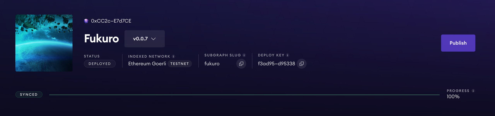

# Fukuro

Bundle curations with [EIP 6551](https://eips.ethereum.org/EIPS/eip-6551). Auction marketplace for EIP 6551 supported tokens.

## Overview

This project leverages EIP 6551 to create an auction marketplace. Users are able to list and bid on Fukuro bundles.

The name "Fukuro" is inspired by the Japanese Fukubukuro, also known as "lucky bags". They are mysterious sealed bags that are sold for a set price. EIP 6551 makes it possible for ERC721s to control "wallet addresses" of their own and hold assets.

Each Fukuro can contain anything that an ethereum address can contain, other NFTs, ERC20 tokens, and much more. This makes it possible to trade a huge variety of assets from artistic collections, trading card sets and even curated investment portfolios.

## How it's Made

This project uses Solidity for smart contracts, Foundry for testing and deployment, Pinata for IPFS pinning, Next js + Tailwind for frontend and wagmi and connect kit for web3 client connections.

For smart contracts, we wrote a custom implementation of EIP 6551 and a custom time-based auction to list EIP 6551-supported tokens. We used Foundry alongside Alchemy RPCs to deploy and test the contracts.

For frontend, we created a marketplace interface with NextJs and Tailwind. We integrated connect kit for smart contract interactions. In order to get tokens owned by a user, we created a The Graph subgraph and queried it from the frontend.

To demo, we deployed a variety of ERC721 and ERC1155 contracts to demonstrate the functionality of EIP 6551 and the auction marketplace that we built.

---

_Created at [ETH Waterloo 2023](https://ethglobal.com/showcase/fukuro-3cdwv)_
